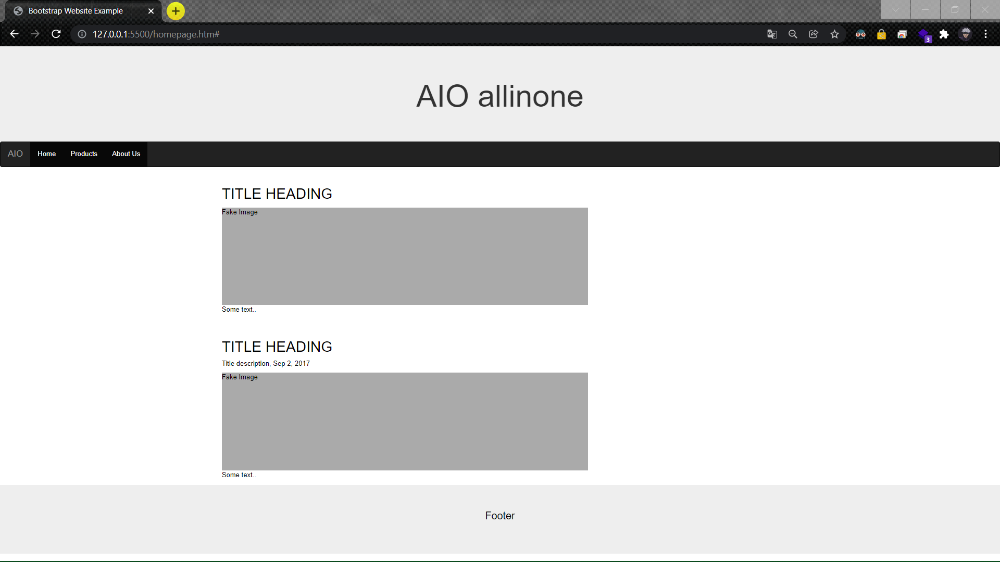
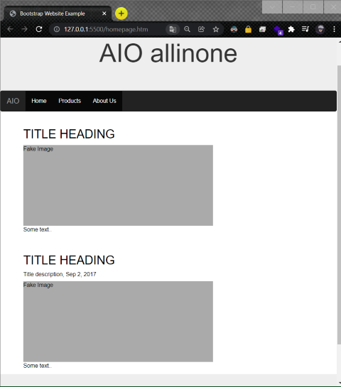

# Company-website-bootstrap

## AIM
create a company website using bootstrap components

# ALGORITHM
### STEP 1
create a simple html page using heading tag
### STEP 2
Add a Bootstrap cdn link to access bootstrap components
### STEP 3
Use bootstrap components to build a website
### STEP 4
Execute the program

# CODE
~~~
<!DOCTYPE html>
<html lang="en">
<head>
  <title>Bootstrap Website Example</title>
  <meta charset="utf-8">
  <meta name="viewport" content="width=device-width, initial-scale=1">
  <link rel="stylesheet" href="https://maxcdn.bootstrapcdn.com/bootstrap/3.4.1/css/bootstrap.min.css">
  
  
  
</head>
<body>

  <h1>AIO allinone</h1>

<nav class="navbar navbar-inverse">
  

    

      <button type="button" class="navbar-toggle" data-toggle="collapse" data-target="#myNavbar">
        
        
                                
      </button>
      <a class="navbar-brand" href="#">AIO</a>
    

    

      <ul class="nav navbar-nav">
        <li class="active"><a href="#">Home</a></li>
        <li class="active"><a href="#">Products</a></li>
        <li class="active"><a href="#">About Us</a></li>
      </ul>
    

  

</nav>

  

   
    

      <h2>TITLE HEADING</h2>
      
Fake Image

      
Some text..

       
      <h2>TITLE HEADING</h2>
      <h5>Title description, Sep 2, 2017</h5>
      
Fake Image

      
Some text..

    

  

  
Footer

</body>
</html>
~~~
# OUPUT

# RESULT
company website using bootstrap components was successfully executed.